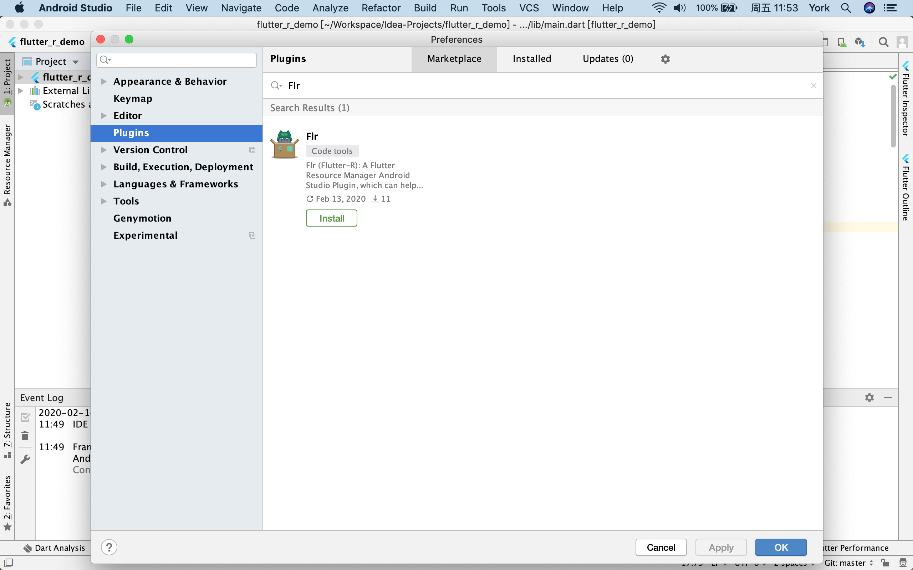

# Flr Plugin

 [ ](https://plugins.jetbrains.com/plugin/13789-flr)

`Flr`（Flutter-R）Plugin：一个Flutter资源管理器AndroidStudio插件，用于帮助Flutter开发者在修改项目资源后，可以自动为资源添加声明到 `pubspec.yaml` 以及生成`r.g.dart`文件。借助`r.g.dart`，Flutter开发者可以在代码中通过资源ID函数的方式应用资源。


📖 *其他语言版本：[English](README.md)、 [简体中文](README.zh-cn.md)*

## Feature
- 支持“自动添加资源声明到 `pubspec.yaml` 和自动生成`r.g.dart`文件”的自动化服务，该服务可以通过手动触发，也可以通过监控资源变化触发
- 支持`R.x`（如`R.image.test()`，`R.svg.test(width: 100, height: 100)`，`R.txt.test_json()`）的代码结构
- 支持处理图片资源（ `.png`、 `.jpg`、 `.jpeg`、`.gif`、 `.webp`、`.icon`、`.bmp`、`.wbmp`、`.svg` ）
- 支持处理文本资源（`.txt`、`.json`、`.yaml`、`.xml`）
- 支持处理字体资源（`.ttf`、`.otf`、`.ttc`）
- 支持处理[图片资源变体](https://flutter.dev/docs/development/ui/assets-and-images#asset-variants)
- 支持处理带有坏味道的文件名的资源：
	- 文件名带有非法字符，如空格、`~`、`#` 等（非法字符是指不在合法字符集合内的字符；合法字符集合的字符有：`0-9`、`A-Z`、 `a-z`、 `_`、`+`、`-`、`.`、`·`、 `!`、 `@`、 `&`、`$`、`￥`）
	- 文件名以数字或者`_`或者`$`字符开头
- 支持处理文件名相同但路径不同的资源

## Install Flr plugin

使用IDE的插件管理器安装该插件：

<kbd>Preferences</kbd> > <kbd>Plugins</kbd> > <kbd>Marketplace</kbd> > <kbd>Search for "Flr"</kbd> > <kbd>Install Plugin</kbd>



## Usage

1. 初始化你的Flutter项目：点击 <kbd>Tools</kbd> > <kbd>Flr</kbd> > <kbd>Init</kbd>

    >`Flr Init` 动作将会检测当前项目是否是一个合法的Flutter项目，并在`pubspec.yaml`中添加`Flr`的配置和[r_dart_library](https://github.com/YK-Unit/r_dart_library) 依赖库的声明。
    >
    >**注意：**
    >
    >Flutter SDK目前处于不稳定的状态，因此若你遇到`r_dart_library`的编译错误，你可以尝试通过修改`r_dart_library`的依赖版本来修复它。
    >
    >你可以根据这个[依赖版本关系表](https://github.com/YK-Unit/r_dart_library#dependency-relationship-table)来选择`r_dart_library`的正确版本。
    
2. 打开`pubspec.yaml`文件，找到`Flr`的配置项，然后配置需要`Flr`扫描的资源目录路径，如：

   ```yaml
    flr:
     core_version: 1.0.0
     # just use for flr-cli and flr-vscode-extension
     dartfmt_line_length: 80
     # config the image and text resource directories that need to be scanned
     assets:
       - lib/assets/images
       - lib/assets/texts
     # config the font resource directories that need to be scanned
     fonts:
       - lib/assets/fonts
   ```

3. 扫描资源，声明资源以及生成`r.g.dart`：点击 <kbd>Tools</kbd> > <kbd>Flr</kbd> > <kbd>Generate</kbd>

    > 调用`Flr Generate` 动作后，`Flr`会扫描配置在`pubspec.yaml`中资源目录，然后为扫描到的资源添加声明到`pubspec.yaml`，并生成`r.g.dart`文件。
    >
    > **若你希望每次资源有变化时，`Flr`就能自动执行上述操作，你可以调用`Flr Start Monitor`动作。**（点击<kbd>Tools</kbd> > <kbd>Flr</kbd> > <kbd>Start Monitor</kbd> ）
    >
    > 这时，`Flr`会启动一个对配置在`pubspec.yaml`中资源目录进行持续监控的服务。若该监控服务检测有资源变化，`Flr`将会自动扫描这些资源目录，然后为扫描到的资源添加声明到`pubspec.yaml`，并生成`r.g.dart`文件。
    >
    > **你可以通过调用以下这个动作来终止当前的监控服务：`Flr Stop Monitor`。**（点击<kbd>Tools</kbd> > <kbd>Flr</kbd> > <kbd>Stop Monitor</kbd>）

## 推荐的flutter资源目录组织结构

 `Flr`推荐如下的flutter资源目录组织结构：

```
flutter_project_root_dir
├── build
│   ├── ..
├── lib
│   ├── assets
│   │   ├── #{module}-images // 某个模块的图片资源总目录
│   │   │   ├── #{main_image_asset}
│   │   │   ├── #{variant-dir} // 某个变体版本的图片资源总目录
│   │   │   │   ├── #{image_asset_variant}
│   │   │   │
│   │   ├── home-images // home模块的图片资源总目录
│   │   │   ├── home_icon.png
│   │   │   ├── home_badge.svg
│   │   │   ├── 3.0x // 3.0倍分辨率版本的图片资源总目录
│   │   │   │   ├── home_icon.png
│   │   │   │
│   │   ├── texts // 文本资源总目录
│   │   │   │     // （你也可以根据模块进一步细分）
│   │   │   └── test.json
│   │   │   └── test.yaml
│   │   │   │
│   │   ├── fonts // 所有字体家族的字体资源总目录
│   │   │   ├── #{font-family} // 某个字体家族的字体资源总目录
│   │   │   │   ├── #{font-family}-#{font_weight_or_style}.ttf
│   │   │   │
│   │   │   ├── Amiri // Amiri字体家族的字体资源总目录
│   │   │   │   ├── Amiri-Regular.ttf
│   │   │   │   ├── Amiri-Bold.ttf
│   │   │   │   ├── Amiri-Italic.ttf
│   │   │   │   ├── Amiri-BoldItalic.ttf
│   ├── ..
```


**需要注意的是，字体资源根目录下的组织结构必须（MUST）采用上述的组织结构：** 以字体家族名称命名子目录，然后字体家族的字体资源放在子目录下。否则，`Flr`可能无法正确扫描字体资源。

## r.g.dart

在你调用`Flr Generate`动作或者`Flr Start Monitor`动作后，`Flr`会扫描`pubspec.yaml`中配置的资源目录，并为扫描到的资源添加声明到`pubspec.yaml`，以及生成`r.g.dart`。

`r.g.dart`中定义了一个资源访问接口类：`R`，让Flutter开发者在代码中可通过资源ID函数的方式应用资源，如：

```dart
import 'package:flutter_r_demo/r.g.dart';

// test_sameName.png
var normalImageWidget = Image(
  width: 200,
  height: 120,
  image: R.image.test_sameName(),
);

// test_sameName.gif
var gifImageWidget = Image(
  image: R.mage.test_sameName_gif(),
);

// test.svg
var svgImageWidget = Image(
  width: 100,
  height: 100,
  image: R.svg.test(width: 100, height: 100),
);

// test.json
var jsonString = await R.text.test_json();

// test.yaml
var yamlString = await R.text.test_yaml();

// Amiri Font Style
var amiriTextStyle = TextStyle(fontFamily: R.fontFamily.amiri);
```

### `_R_X` class

`r.g.dart`中定义了几个私有的`_R_X`资源管理类：`_R_Image`、`_R_svg`、`_R_Text`、`_R_FontFamily`。这些私有的资源管理类用于管理各自资源类型的资源ID：

- `_R_Image`：管理非SVG类的图片资源（ `.png`、 `.jpg`、 `.jpeg`、`.gif`、 `.webp`、`.icon`、`.bmp`、`.wbmp`）的资源ID
- `_R_Svg`：管理SVG类图片资源的资源ID
- `_R_Text`：管理文本资源（`.txt`、`.json`、`.yaml`、`.xml`）的资源ID
- `_R_FontFamily`：管理字体资源（`.ttf`、`.otf`、`.ttc`）的资源ID

### `R` class and `R.x` struct

`r.g.dart`中定义了一个资源访问接口类：`R`，用来管理公共信息，聚合`_R_X`资源管理类，和实现`R.x`的代码结构方式：

```dart
/// This `R` class is generated and contains references to static asset resources.
class R {
  /// package name: flutter_r_demo
  static const package = "flutter_r_demo";

  /// This `R.image` struct is generated, and contains static references to static non-svg type image asset resources.
  static const image = _R_Image();

  /// This `R.svg` struct is generated, and contains static references to static svg type image asset resources.
  static const svg = _R_Svg();

  /// This `R.text` struct is generated, and contains static references to static text asset resources.
  static const text = _R_Text();
}

  /// This `R.fontFamily` struct is generated, and contains static references to static font resources.
  static const fontFamily = _R_FontFamily();
```

## Example

这里提供了一个[Flutter-R Demo](https://github.com/Fly-Mix/flutter_r_demo)来展示如何在Flutter项目中使用`Flr`工具和在代码中如何使用`R`类。

## License

The plugin is available as open source under the terms of the [MIT License](https://opensource.org/licenses/MIT).
